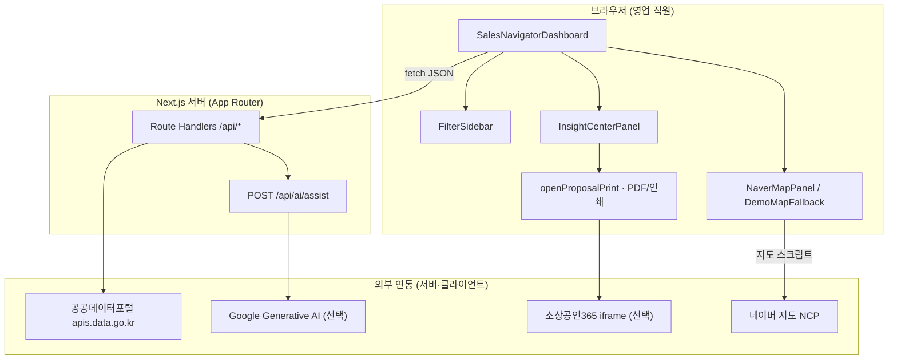
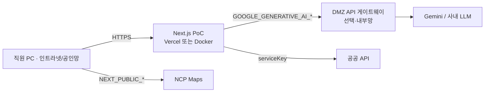
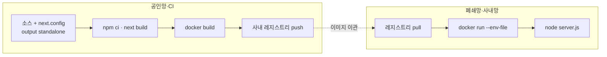
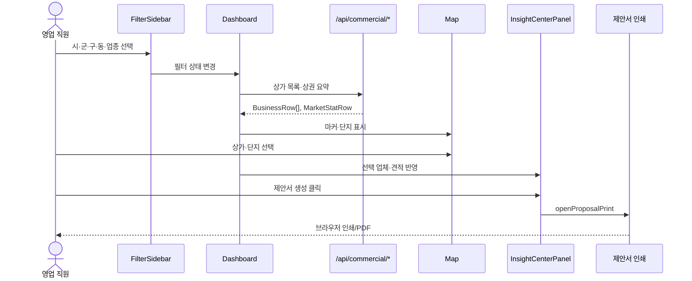
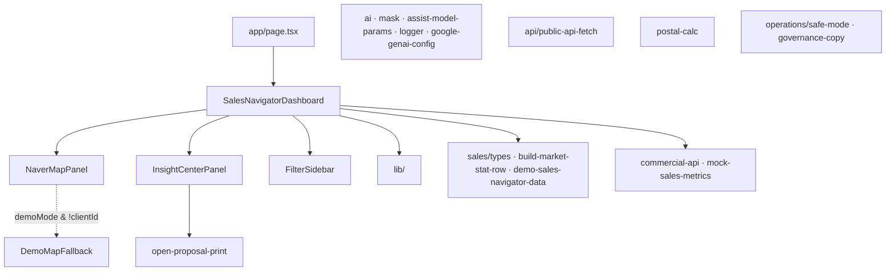
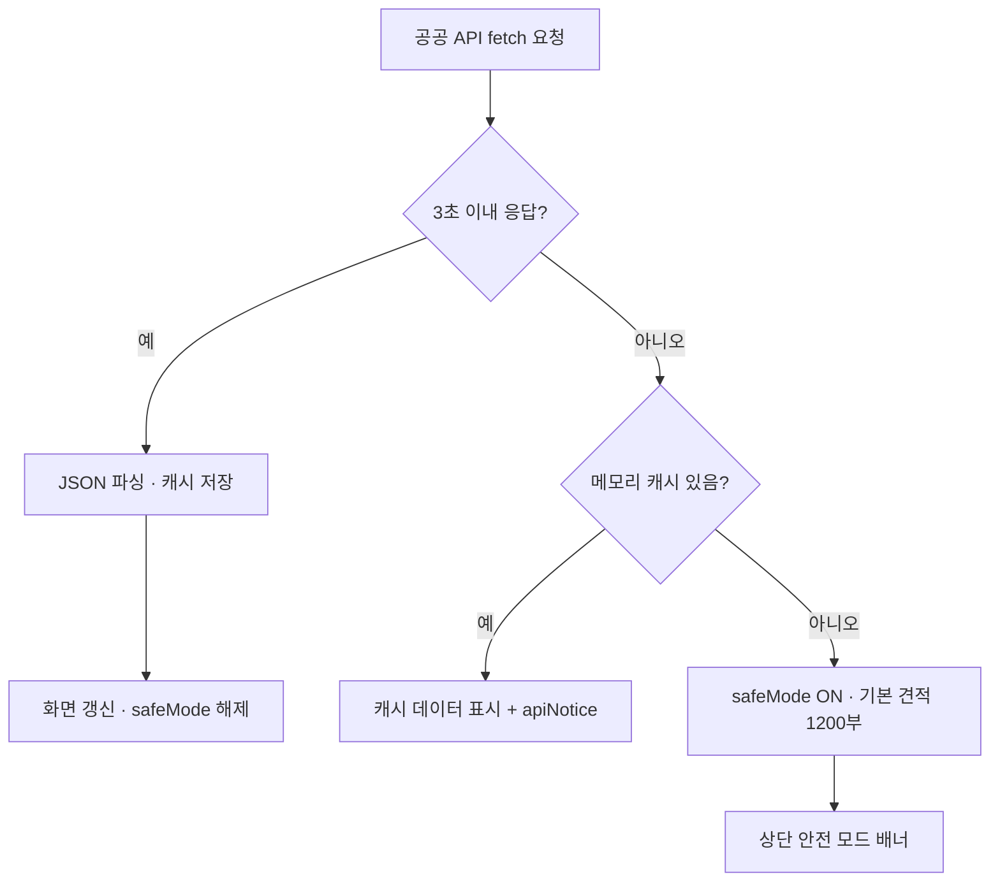
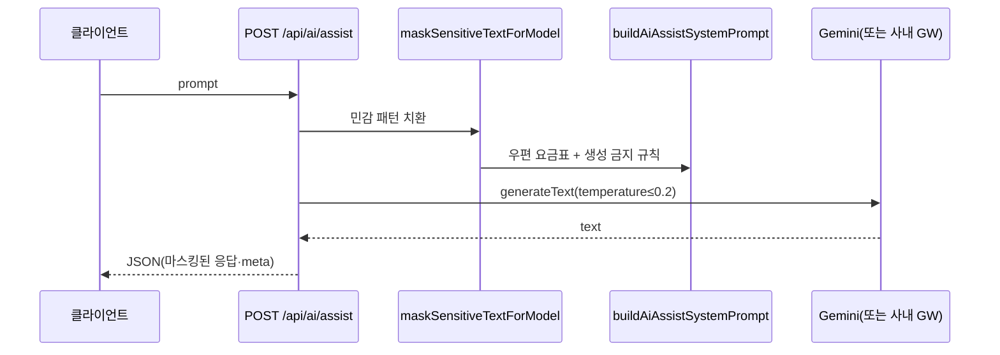

# 개발 설계서

**과제명:** [우편 매출 혁신] 공공데이터 상권 분석 기반 생활정보홍보우편 스마트 영업 네비게이터 구축 및 실증(PoC)  
**문서 버전:** 2.3  
**작성 목적:** 우정사업본부 「2026 AI 혁신 아이디어 공모전」·「AI 업무 툴 직접 개발」 **필수 제출 서류(개발 설계서)**  
**제출 범위:** **본 문서(`개발-설계서.md`) 단독 제출.** 심사·감사·구현 검토는 본 문서만으로 과제 목적·기능·아키텍처·보안·배포·운영을 파악할 수 있도록 작성하였습니다. (`im.md` 등 저장소 내 다른 md는 개발 과정용 초안이며 제출 대상이 아닙니다.)

### 목차

| 절 | 제목 |
|----|------|
| 1 | 문서 개요·Pain Point·AI 단계 구분·심사 대응 |
| 2 | 시스템 아키텍처 |
| 3 | 화면·UI 설계 |
| 4 | 프론트엔드 구조 |
| 5 | 데이터 설계 |
| 6 | API 설계 |
| 7 | 제안서(PDF) 템플릿 |
| 7.5 | 견적·요금 산출 |
| 8 | 공공 API Fallback·캐싱 |
| 9 | 보안·AI·로그(할루시네이션 억제·내부망 경로) |
| 10 | 데모 모드 |
| 11 | 배포·Standalone·Docker·환경 변수·자동 검증 |
| 12 | 운영 주체·데이터 갱신·API 쿼터 |
| 13 | 저장소 참고 문서(제출 불필요) |
| 부록 | 시연 체크리스트·문서 이력 |

---

## 1. 문서 개요

### 1.1 시스템 목적

우체국 **생활정보홍보우편** B2B 영업에서 필요한 **상권·상가·배후 수요(아파트 세대)** 정보를 한 화면에 모아, **견적·상담 초안·제안서(PDF)** 까지 연결하는 **웹 기반 영업 지원 PoC**입니다.

### 1.2 대상 사용자

- 우체국 **B2B 영업 직원**(창구·현장 영업)
- **심사·설문** 시: 배포 URL(https://post-sales-manager.co.kr) 또는 `?demo=1` 목업 모드로 API 키 없이 체험 가능

### 1.3 기술 스택

| 구분 | 기술 |
|------|------|
| 프레임워크 | Next.js 16 (App Router) |
| 언어 | TypeScript (strict 권장) |
| UI | React 19, Tailwind CSS, shadcn/ui |
| 지도 | 네이버 지도 Open API (NCP) — 클라이언트 |
| AI(선택) | Vercel AI SDK + Google Generative AI (`@ai-sdk/google`) |
| 배포 | Vercel / 사내 **Docker**(`output: 'standalone'`) / Node `next start` |

### 1.4 PoC 범위 및 제외

| 포함 | 제외(상용 단계) |
|------|-----------------|
| 공공 API 프록시·지도·견적·제안서 출력 | 전국 운영 SLA·민원 체계 |
| 가공·시연 지표 및 화면 고지 | 대규모 서버 캐시·Redis |
| 선택적 AI 보조·마스킹·로그·**할루시네이션 억제** | CRM·접수 시스템 본연동 |
| **사내망 Standalone·Docker** 배포 | 전사 컨테이너 오케스트레이션·DR 표준 |

### 1.5 본 문서 구성(기능 → 절)

| 기능·주제 | 절 | 구현 근거(요지) |
|-----------|-----|-----------------|
| 상권 시각화·타겟·단지 | §2, §3, §6 | 지도·상가 API·국토부 단지 |
| 맞춤 상담·AI 보조 | §1.6.2, §6.3, §9 | 규칙 상담 초안 + 선택 `/api/ai/assist` |
| 제안서 ROI 가정 | §7.3 | `proposal-roi-assumptions.ts` |
| 실시간 견적·감액 | §7.5 | `lib/postal-calc.ts` |
| 제안서 PDF A/B/C | §7 | `open-proposal-print.ts` |
| 공공 API 장애 대응 | §8 | 3초 타임아웃·캐시·안전 모드(1,200부) |
| 설문·키 없는 시연 | §10 | `?demo=1` |
| 사내망 Docker | §11.1 | `output: 'standalone'` |
| 운영·쿼터 고지 | §5.2, §12 | 푸터·PDF·`governance-copy` |

### 1.6 과제 신청 요약

| 항목 | 내용 |
|------|------|
| **제목** | [우편 매출 혁신] 공공데이터 상권 분석 기반 「생활정보홍보우편 스마트 영업 네비게이터」 구축 및 실증(PoC) |
| **개요** | 소상공인시장진흥공단·국토교통부 등 **공공데이터**로 상권·배후 세대(아파트)를 분석하고, 영업 직원이 **타겟 선정 → 맞춤 상담 → 견적 → 제안서(PDF)** 를 한 화면에서 수행하는 웹 PoC |
| **개발 기간** | 약 3주 (2026. 5. 1. ~ 2026. 5. 22.) |
| **현재 상태** | ☑ 구현완료 (배포 URL 또는 사내 Docker로 시연 가능) |

**개발 목적**

- **문제:** 생활정보홍보우편 B2B 영업에서 업체 발굴·타겟팅(배달 세대수)·제안서 작성에 시간이 많이 들고, **개인 역량·감**에 의존함(§1.6.1 근거).
- **해결:** 공공데이터·지도·우체국 요금 기준(접착형)을 묶어 **1건당 제안 패키지**를 단시간에 생성하고, 선택적 AI로 문장을 보강(§1.6.2).

### 1.6.1 영업 직원 Pain Point 근거(목표 부합성)

PoC 단계에서는 전국 실적 DB를 직접 연동하지 않았으나, **문제 정의·목표 수치**는 아래와 같이 **정량 목표 + 검증 경로**를 명시합니다. 상용화 시 우정사업본부 **내부 영업 실적·접수 오류 로그**로 치환·검증하는 것을 전제로 합니다.

| Pain 지표 | 개선 전(근거·PoC 가정) | PoC 목표(본 과제) | 검증·보강 경로 |
|-----------|------------------------|-------------------|----------------|
| **1건 제안 패키지 소요** | 상권 조사(포털·지도)·세대 추정·요금·Word/PPT 제안서 작성을 **업무 분해 시 약 90~120분/건** 수준으로 가정(현장 워크숍·동료 영업 사례 정리, PoC 설계 입력값) | 화면에서 **타겟·상담 초안·접착형 요금·PDF**까지 **1분 이내** 초안(§1.10) | 배포 URL 시연·2차 **직원 설문(30점)** |
| **요금·부수 산정 오류** | 수기 계산·경험치 혼용 시 **건당 오견적·재협상** 발생 가능(정성) → PoC는 **단일 요금 모듈**(`postal-adhesive-pricing.ts`·우체국 접착형 안내)로 표기 통일 | 참고 견적·문구 **자동 생성** | 제안서·상담 초안 동일 문구 |
| **타겟 선정** | 동·상권 **무작위 방문·감** | 공공 API·지도 필터·세종 등 **행정동 3단계** | `/api/commercial/stores`, §2 |
| **제안 설득 자료** | 업종별 스토리·수치 **개인 템플릿** | 템플릿 A/B/C + **가정치 명시 ROI**(§7.3) | `open-proposal-print.ts` |

**정리:** 「2시간 → 1분」은 **PoC 시연 목표**이며, 개선 전 구간은 **영업 업무 분해 기반 가정치**입니다. 인터뷰·설문 **실측 표본 수**는 2차 심사 설문에서 확보·보고하는 구조로 설계했습니다.

### 1.6.2 AI 도입 단계 구분(규칙 기반 vs AI 보조)

심사 기준의 **AI 도입 필요성**에 맞추어, 본 PoC는 **① 항상 동작하는 규칙 엔진**과 **② 선택적 생성형 AI**를 분리합니다.

| 구분 | 규칙 기반(핵심·AI 없이 동작) | AI 보조(선택, `POST /api/ai/assist`) |
|------|------------------------------|-------------------------------------|
| **역할** | 상담 초안·제안서 PDF·견적 문구 | 선택적 `POST /api/ai/assist`(서버·키 설정 시, UI 프롬프트 입력은 PoC 미노출) |
| **구현** | `InsightCenterPanel` 규칙 문장, `buildTemplateContent`, `postal-adhesive-pricing` | `maskSensitiveTextForModel` → `buildAiAssistSystemPrompt` → Gemini |
| **데이터** | 공공 API·평가정보·업종 템플릿 | 동일 + **우편 요금표만** System Prompt 삽입(§9.1) |
| **AI 없을 때 한계** | 문장 패턴·업종 분기 **고정**, 예외 질문·장문 커스터마이징 **불가** | — |
| **AI 있을 때 이점** | 동일(오프라인·키 미설정 환경 **완전 동작**) | 멘트 다듬기·상황별 Q&A (**temperature≤0.2**, 요금표 외 생성 금지) |
| **개발 단계 AI** | Cursor AI **페어 프로그래밍**(코드·설계서 작성) | 런타임 AI는 **선택** — 내부망·윤리 정책에 맞게 on/off |

**PoC 메시지:** AI는 **영업 필수 인프라가 아닌 확장층**이며, **규칙 기반만으로도 목표 부합(상권·견적·제안서)** 을 달성합니다. AI는 **생산성·표현 품질**을 높이는 **2단계 가치**로 명시합니다.

### 1.7 심사 기준 및 본 PoC 대응

#### 1차 심사: AI 서류심사 (100점)

| 배점 항목 | 대응 내용(본 PoC) |
|-----------|-------------------|
| 창의성·독창성 (20) | 단순 우편 발송 안내를 넘어 **공공 API 상권 분석 + B2B 마케팅 컨설팅형** 영업 네비게이터 |
| 기술적 구현력 (30) | 소진공·국토부 API 연동, **견적·감액 알고리즘**, 제안서 템플릿 분기(§6, §7, §7.5) |
| AI 활용 최적화 (30) | 개발 단계 **Cursor AI 페어 프로그래밍** + 런타임 **AI 보조 멘트**(마스킹·할루시네이션 억제, §9) |
| 기대효과·확장성 (20) | 전국 상권 적용 가능 구조, CRM·내부망 Docker 연계 로드맵(§11, §12) |

#### 2차 심사·가점

| 항목 | 대응 |
|------|------|
| 직원 설문 (30) | 현장 Pain(상권 분석·견적·제안서) **자동화**, `?demo=1`로 키 없이 UX 체험(§10) |
| 위원 평가 (40) | **목표 부합** — §1.6.1 Pain 정량·§1.6.2 AI 단계 구분·§7.3 ROI 가정 고지 |
| AI 공개 심사 (30) | 완성도·기술성·**안전성·윤리**(마스킹·로그·요금표 외 생성 금지, §9) |
| **가점 (10)** | **내부망 즉시 구동** — Standalone Docker(§11.1), 실증 가능한 완성 PoC |

#### 1.7.1 기존 상권 서비스 대비 차별화(창의성)

| 구분 | 네이버 스마트플레이스·일반 지도 | 소상공인365 웹 | **본 PoC(우체국 영업 네비게이터)** |
|------|------------------------------|----------------|-----------------------------------|
| 목적 | 매장 노출·리뷰·예약 | 상권·업종 통계 조회 | **생활정보홍보우편 B2B 영업** (타겟·견적·제안서) |
| 데이터 | 플랫폼 자체 데이터 | 소진공 상권 API | **소진공+국토부+행안부** 3기관 **단일 화면** |
| 우편 연계 | 없음 | 없음 | **접착형 요금·감액 참고·PDF 제안서** 원클릭 |
| 영업 산출물 | 매장 관리 UI | 리포트·차트 | **상담 초안·규칙 템플릿 A/B/C·AI 요약(선택)** |
| 배포 | SaaS | 웹 포털 | **사내망 Docker Standalone** + `?demo=1` 설문 |

### 1.8 개발 방법·로드맵·AI 도구

**사용 AI·도구:** Cursor AI(Claude 등 LLM) — UI·API 연동·요금 로직·상태 관리·제안서 인쇄·리팩토링 전반에 **Human-AI 페어 프로그래밍** 적용.

**개발 방법(요지)**

1. 현장 Pain(데이터 확보·제안서 작성 시간) 분석  
2. 소진공·국토부 **공공 API** 연계 설계  
3. 지도 60% / 인사이트 20% / 필터 20% **3단 레이아웃** 설계  
4. Cursor로 Next.js·React 구현 및 반복 검증  
5. API·견적·PDF·데모·안전 모드·Docker까지 통합 PoC 완료  

**단계별 로드맵**

| 단계 | 내용 |
|------|------|
| 1 | UI·네이버 지도·공공 API Route Handler |
| 2 | 아파트 세대 기반 수량·**우편 요금·감액(최대 30%)** 자동 계산 |
| 3 | 업종별 **영업 스크립트·제안서(PDF)** 템플릿 |
| 4 | 소상공인365 iframe 부록·전체 통합·PoC 시연 |

### 1.9 기능 명세(사용자 관점)

1. **상권 시각화·타겟:** 지도에 상가·아파트(배후수요)·반경 표시, 세대수 합산.  
2. **맞춤 상담:** 업력·매출 추이에 따른 위기 극복형(B)·기회 창출형(A)·서비스형(C) 멘트(규칙 + 선택 AI).  
3. **실시간 견적:** 발송 부수·감액 구간 반영 최종 견적(§7.5).  
4. **제안서 PDF:** 지도·상권 지표·스크립트·견적·소상공인365 부록 원클릭(§7).  
5. **공공 API 장애 대응:** 3초 타임아웃·캐시·**안전 모드(1,200부)** (§8).  
6. **선택 AI 보조:** 마스킹·temperature≤0.2·우편 요금표 System Prompt(§9).  
7. **사내망 배포:** Standalone Docker(§11.1).  

### 1.10 기대 효과

| 지표 | 개선 전 → 개선 후 |
|------|-------------------|
| 상권 분석·제안서 작성 시간 | 약 2시간 → **1분 이내** |
| 수기 요금·세대수 오류 | 빈번 → **시스템 자동 계산으로 최소화** |
| 정성 효과 | 감·경험 의존 → **데이터 기반(Data-Driven)** B2B 영업, 고객 신뢰·직원 피로도 개선 |

### 1.11 확산성·효과성 (PoC 구현)

| 항목 | 구현 |
|------|------|
| **직원 설문 피드백** | `SessionFeedbackBar` + `POST /api/feedback` (썸업/다운, 서버 인메모리 누적) |
| **전국 시·군·구** | 시·도 선택 시 `GET /api/regions/search`로 시·군·구 동적 조회, 부족 시 `lib/sales/sigungu-static-data.ts` 폴백(기준일 `SIGUNGU_DATA_AS_OF`) |
| **데모·독립 배포** | `?demo=1`, Standalone Docker(§11.1) |

---

## 2. 시스템 아키텍처

### 2.1 논리 구성도



### 2.2 배포·망 구성



### 2.3 사내망 Standalone·Docker 배포 흐름



- **실데이터 모드:** Next 서버가 `PUBLIC_DATA_API_KEY`로 공공 API를 호출합니다.
- **데모 모드 (`?demo=1`):** 클라이언트 목업 데이터만 사용, 공공 API 호출을 우회합니다.
- **내부망 AI:** `GOOGLE_GENERATIVE_AI_BASE_URL`로 프록시 경로 지정 — §9.3.
- **사내망 Standalone:** 사내망 배포 시 **인터넷 연결이 불필요**하도록 Next.js **`output: 'standalone'`**으로 경량 Docker 이미지 제공 — §11.1. (빌드는 공인망·CI, 실행은 레지스트리 pull만.)

---

## 3. 화면·UI 설계

### 3.1 레이아웃 (데스크톱)

| 영역 | 비율 | 주요 컴포넌트 | 역할 |
|------|------|---------------|------|
| 좌측 | 약 60% | `NaverMapPanel` | 상가 마커·단지(🏠)·반경 1km 원 |
| 중앙 | 약 20% | `InsightCenterPanel` | 상권 지표·견적·상담·제안서 생성 |
| 우측 | 약 20% | `FilterSidebar` | 시도/구/동·업종·매출 추세·목록 |
| 하단 | 전폭 | 데이터 고지 푸터 | 실데이터/가공/시뮬레이션·운영·쿼터 안내 |

### 3.2 모바일·태블릿

- 지도를 넓게 쓰고, **하단 시트**(`Sheet`)에서 「상담·제안」/「필터·목록」 탭 전환.

### 3.3 주요 사용자 흐름



---

## 4. 프론트엔드 구조



| 모듈 | 역할 |
|------|------|
| `SalesNavigatorDashboard` | 전역 상태·API 호출·데모 분기·모바일 시트 |
| `NaverMapPanel` | 네이버 지도·마커·지오코딩·단지 선택 |
| `DemoMapFallback` | NCP 키 없을 때 정적 미니맵(`?demo=1` 등) |
| `InsightCenterPanel` | 인사이트 카드·제안서 버튼·가공 고지 |
| `FilterSidebar` | 지역·업종 필터·상가 목록 |
| `open-proposal-print` | HTML 제안서 생성·템플릿 A/B/C |
| `lib/postal-calc.ts` | 발송 부수·감액 구간 견적(화면·AI 요금표 동일 출처) |
| `lib/api/public-api-fetch.ts` | 공공 API 타임아웃(3초)·TTL 캐시(5분) |
| `lib/operations/safe-mode.ts` | API 장애 시 기본 견적(1,200부) |

---

## 5. 데이터 설계

### 5.1 핵심 엔티티

#### `BusinessRow` (상가·업체)

| 필드 | 타입 | 설명 |
|------|------|------|
| `id` | string | 앱 내 고유 ID |
| `name` | string | 상호 |
| `category` | string | 소·중분류명 표시용 |
| `address` | string | 도로명/지번 주소 |
| `regionCode` | string | 행정동·법정동 코드(필터 키) |
| `ldongCd` | string? | 국토부 단지 API용 10자리 법정동 |
| `lat`, `lng` | number? | WGS84 좌표 |
| `revenueTrend` | number | 전월 대비 매출 변동(%) — **가공·시연** |
| `indsLclsCd` 등 | string? | 업종 대·중·소분류 코드 |

#### `MarketStatRow` (상권 요약)

| 필드 | 설명 |
|------|------|
| `dongHouseholds`, `housingCount` | 세대·주택 수(가공 모델) |
| `floatingPop` | 유동인구(가공) |
| `housingGrowthPct` | 주택 증가율(가공) |
| `metricsSourceLabel` | 출처 고지 문구 |

### 5.2 데이터 성격 구분

| 구분 | 예시 | 고지 위치 |
|------|------|-----------|
| **실데이터** | 상가 목록(공공 API), 지도 좌표 | 지도 배지·API 출처 |
| **가공·시연** | 매출 추세 %, 평가정보, 상권 요약 일부 | 필터·카드·PDF 상단 |
| **시뮬레이션** | 견적 ROI 가정, 데모 상가 | `?demo=1`, 데모 배너 |

운영 주체·갱신·쿼터: §12.

### 5.3 영업 우선순위 스코어링 알고리즘

선택 업체의 **영업 제안 적합도**를 0~100점·A/B/C 등급으로 산출하는 규칙 기반
알고리즘입니다(`lib/sales/target-scoring.ts`, 단위 테스트 `tests/target-scoring.test.ts`).

**점수식** — 4개 요인을 0~1 로 정규화(고정 상한 포화) 후 가중합:

\[
score = 100 \times (0.4 \cdot f_{하락} + 0.3 \cdot f_{세대} + 0.2 \cdot f_{경쟁} + 0.1 \cdot f_{유동})
\]

| 요인 | 정규화 | 가중치 | 영업 가설 |
|------|--------|:---:|-----------|
| \(f_{하락}\) 매출 하락 신호 | `max(0, −매출변동%) / 30` | 0.4 | 하락 업체일수록 신규 고객 유입(홍보우편) 제안 적기 |
| \(f_{세대}\) 배후 수요 | `동 세대수 / 20,000` | 0.3 | 배후 세대가 많을수록 우편 도달 효과 큼 |
| \(f_{경쟁}\) 경쟁 밀도 | `동일 소분류 업체수(자신 제외) / 30` | 0.2 | 경쟁이 많을수록 차별화 홍보 필요 |
| \(f_{유동}\) 유동인구 | `유동인구 / 50,000` | 0.1 | 보조 지표 |

- **등급 컷:** A ≥ 65(우선 제안) / B ≥ 40(검토) / C(후순위)
- **결정성:** 같은 입력 → 같은 출력(난수·외부 호출 없음) — 심사·재현 가능
- **UI:** 중앙 인사이트 패널 "영업 우선순위 점수" 카드 — 등급 배지 + 점수 근거 한글 설명. 매출 추세가 시연용 가공 지표임을 카드에 고지
- **한계·로드맵:** PoC 는 선형 가중합(해석 가능성 우선). 상용 단계에서 실제 매출·계약 전환 데이터가 축적되면 가중치 학습(로지스틱 회귀 등)으로 고도화

---

## 6. API 설계 (내부 Route Handler)

모든 외부 키는 **서버 환경 변수**에 두며, 브라우저에 `PUBLIC_DATA_API_KEY`를 노출하지 않습니다.

### 6.1 상가·상권·업종 (소진공 상가 API 프록시)

| 메서드 | 경로 | 주요 쿼리/본문 | 외부 연동 | 응답 요약 |
|--------|------|----------------|-----------|-----------|
| GET | `/api/commercial/stores` | `dong`, `indL`, `indM`, `indS` | 상가업소 목록 | `{ ok, rows: BusinessRow[] }` |
| POST | `/api/commercial/market-stats` | `{ regions: [{ code, label? }] }` | 없음(서버 가공) | `{ ok, byRegion }` |
| GET | `/api/commercial/industry-large` | — | 업종 대분류 | `{ ok, items[] }` |
| GET | `/api/commercial/industry-medium` | `large` | 업종 중분류 | `{ ok, items[] }` |
| GET | `/api/commercial/industry-small` | `large`, `medium` | 업종 소분류 | `{ ok, items[] }` |
| GET | `/api/commercial/getEvlInfo` | `businessId`, `name` | **PoC 목업** — 소진공 평가정보 API는 별도 사업자 계약 필요(`buildMockEvlInfo`) | `{ ok, info }` |
| GET | `/api/commercial/getAreaIndutyAvrOutStats` | `dong`, `indL?` | 외식 평균매출 | `{ ok, avgSalesAmount, ... }` |
| GET | `/api/commercial/getAreaIndutyAvrWhrtStats` | 동일 | 도소매 평균매출 | 동일 |
| GET | `/api/commercial/getAreaIndutyAvrSrvcStats` | 동일 | 서비스 평균매출 | 동일 |

### 6.2 지역·국토부

| 메서드 | 경로 | 주요 파라미터 | 외부 연동 | 응답 요약 |
|--------|------|---------------|-----------|-----------|
| GET | `/api/regions/search` | `q` (2자 이상) | 행정표준코드 검색 | `{ ok, results: [{ code, label }] }` |
| GET | `/api/molit/getAptList` | `bjdongCd`, `lat`, `lng`, `radiusM` | 공동주택 단지 목록 | `{ ok, items: MolitAptComplex[] }` |

### 6.3 AI 보조

| 메서드 | 경로 | 본문 | 비고 |
|--------|------|------|------|
| POST | `/api/ai/assist` | `{ "prompt": string }` | 마스킹·System Prompt(우편 요금표)·temperature ≤0.2 후 Gemini; 키 없으면 `503 AI_DISABLED` |

내부망 경로: §9.3. System Prompt·temperature: `lib/ai/assist-model-params.ts`, 요금표: `lib/postal-calc.ts`.

### 6.4 공통 오류·키 없음

| HTTP | 의미 |
|------|------|
| 400 | 필수 파라미터 누락 |
| 503 | `PUBLIC_DATA_API_KEY` 또는 AI 키 미설정 |
| 422 | AI 요청 본문 검증 실패 |

---

## 7. 제안서(PDF) 템플릿 설계

### 7.1 템플릿 유형

| ID | 명칭 | 적용 업종(요지) |
|----|------|-----------------|
| **A** | 외식업 / 기회 창출형 | 외식·음식, 코드 `I`, 매출 성장 휴리스틱 |
| **B** | 도소매업 / 위기 극복형 | 도소매·소매, 코드 `G`, 장기 업력 휴리스틱 |
| **C** | 서비스업 / 생활밀착형 | 서비스 명칭, 코드 `L,M,N,P,Q,R,S` |

### 7.2 분기 순서 (`resolveTemplateType`)

1. 화면 **업종 대분류명**(`industryLargeLabel`) + `indsLclsCd` **선두 1자**
2. `category` 문자열 키워드
3. `revenueTrend`·업력 휴리스틱

**서비스(C)** 는 매출·업력 분기보다 **우선**하여, 서비스업이 도소매형(B)으로 잘못 분기되는 것을 방지합니다.

`InsightCenterPanel` → `openProposalPrint` 시 `selectedLargeName`을 `industryLargeLabel`로 전달해 **필터 선택과 PDF 템플릿을 일치**시킵니다.

템플릿 C(서비스) 보조 설명은 §7.1 표와 `resolveTemplateType` 주석을 따릅니다.

### 7.3 제안서 ROI 시뮬레이션(가정치·출처 고지)

템플릿 A/B/C의 전환·회수율(**1.0% / 0.5% / 2.0%**)은 **생활정보홍보우편 실측 통계가 아닌 PoC 시연용 가정치**입니다.

| 템플릿 | 가정 전환·회수율 | 용도 |
|--------|------------------|------|
| A 외식 | 1.0%(가정) | 기회 창출형 시뮬레이션 |
| B 도소매 | 0.5%(가정) | 방어형 시뮬레이션 |
| C 서비스 | 2.0%(가정) | 쿠폰 회수 시뮬레이션 |

- **참고 범위:** 일반 광고·DM류에서 흔히 인용되는 **0.5~2% 구간**(업계 관행·문헌 범위)을 분기용으로만 사용.
- **상용 교체:** 우정사업본부 **내부 통계·광고우편 벤치마크**로 `lib/proposal-roi-assumptions.ts` 상수·문구 교체.
- **코드:** `buildProposalRoiNarrative()` — PDF Section 3 본문·`PROPOSAL_ROI_SIMULATION_DISCLAIMER` 고지.

---

## 7.5 견적·요금 산출

화면 견적과 AI System Prompt의 **우편 요금표는 동일 모듈**(`lib/postal-calc.ts`)을 사용합니다.

| 항목 | PoC 기준 |
|------|----------|
| 기준 부당 단가 | 280원 (참고치) |
| 특별 감액 구간 | 500부 10% → 1,500부 15% → 3,000부 20% → 5,000부 25% → 8,000부 30% |
| 계산 | 기준 총액 = 부수 × 단가, 최종 = 기준 × (100 − 감액률) / 100 |
| 고지 | 최종 청구는 **우체국 확정 견적** 기준 |

- **AI 연동:** `formatPostalRateTableForAiSystem()`이 위 규칙을 System Prompt 본문으로 삽입(§9.1).
- **안전 모드:** 공공 API 장애·캐시 없음 시 `SAFE_MODE_DEFAULT_MAIL_QTY`(1,200부)로 동일 함수 호출(§8).

---

## 8. 공공 API 장애 시 Fallback·캐싱 전략

공공 API 지연·장애 시에도 영업 화면이 **완전히 멈추지 않도록** 클라이언트에 **타임아웃·메모리 캐시·안전 모드(기본 견적)** 를 둡니다. PoC에서는 별도 SWR/React Query 의존성 없이, **동일 역할의 경량 캐시**(`lib/api/public-api-fetch.ts`)로 구현합니다. 상용 단계에서 **SWR 또는 React Query** 로 교체·확장할 수 있습니다.

### 8.1 동작 요약

| 단계 | 조건 | UI·데이터 동작 |
|------|------|----------------|
| 1 | 정상 응답(3초 이내) | 응답 JSON을 **메모리 캐시**(TTL 5분)에 저장 후 표시 |
| 2 | **타임아웃(기본 3초)** 또는 네트워크 오류 + **캐시 hit** | `fromCache: true` — **직전 성공 데이터** 표시, 상단에 캐시 안내(`apiNotice`) |
| 3 | 타임아웃·오류 + **캐시 miss** | **안전 모드** 전환 — 권장 발송 **1,200부** 기준 **기본 견적**, 상단 배너 「안전 모드(기본 견적)」 |

### 8.2 적용 대상(클라이언트)

- `GET /api/commercial/stores` — 상가 목록(필터 변경 시)
- `POST /api/commercial/market-stats` — 상권 요약

기타 업종·단지 API는 기존 `fetch`를 유지하며, 상용화 시 동일 유틸로 통일할 수 있습니다.

### 8.3 안전 모드 상수

| 항목 | 값·문구 |
|------|---------|
| 기본 부수 | `SAFE_MODE_DEFAULT_MAIL_QTY` = **1,200부** |
| 배너 제목 | 안전 모드(기본 견적) |
| 구현 | `lib/operations/safe-mode.ts`, `SalesNavigatorDashboard`, `InsightCenterPanel` |

### 8.4 흐름도



### 8.5 설계 문구(심사·설계서 인용)

> 공공 API 지연/장애 시, SWR 또는 React Query의 캐시 데이터를 활용하거나 Timeout(예: 3초) 발생 시 UI에 **「안전 모드(기본 견적)」** 로 전환되도록 예외 처리를 구현하였다. PoC 단계에서는 React Query/SWR과 동등한 **인메모리 TTL 캐시**와 `AbortController` 기반 타임아웃으로 동일 정책을 적용한다.

### 8.6 API 일일 한도(쿼터) 초과

| 신호 | 처리 |
|------|------|
| HTTP **429** | `lib/api/public-api-fetch.ts` — `quotaExceeded`, 사용자 메시지 「API 일일 한도 초과…」 |
| `resultCode` **22** 등(본문·오류 문자열) | `lib/api/public-data-quota.ts` `detectPublicApiQuotaExceeded` |
| 상가 Route | 동일 탐지 시 `429` + `code: QUOTA_EXCEEDED` |

### 8.7 캐시 계층(구현)·상용 로드맵

**서버 캐시(구현):** `lib/api/server-cache.ts` — **TTL+LRU 인메모리 캐시**(최대 200키),
단위 테스트 `tests/server-cache.test.ts` 로 TTL 만료·LRU 퇴출·미스 1회 로딩을 검증.
**Redis 와 호환되는 비동기 인터페이스(`CacheStore`: get/set/delete)** 로 설계해
상용 전환 시 구현체만 Redis 클라이언트로 교체하면 라우트 코드 변경이 없습니다.

| 적용 라우트 | 캐시 키 | TTL | 근거 |
|------|------|:---:|------|
| `GET /api/commercial/stores` | `stores:{시군구}:{업종 대·중·소}` | 10분 | 소진공 상가 데이터는 분기 갱신 — 반복 조회 쿼터·지연 절감. 응답 `X-Cache: HIT/MISS` 헤더로 확인 가능 |
| `GET /api/regions/search` | `stan:{검색어}` | 1시간 | 행정표준코드는 행정구역 개편 전까지 불변 |

| 환경 | 동작 |
|------|------|
| PoC(브라우저) | `memoryCache` Map — **탭·세션 단위**, TTL 5분, `clearPublicApiMemoryCache()`(대시보드 언마운트·시·도 초기화) |
| PoC(서버) | 위 **TTL+LRU 서버 캐시** — 동일 인스턴스 내 모든 사용자 간 공유 |
| Vercel Serverless | 서버 캐시는 **콜드 스타트 시 소실**(웜 인스턴스에서는 유효) — 클라이언트 캐시와 이중화 |
| 상용(권장) | `CacheStore` 구현체를 **Redis/KV** 로 교체 + 쿼터 모니터링·`numOfRows` 페이지 순회(§6 상가 API) |

---

## 9. 보안·AI·로그

| 항목 | 구현 요지 |
|------|-----------|
| 입력 마스킹 | 이메일·전화·주민번호형·**사업자등록번호**·긴 숫자열 → 토큰 치환 후 모델 전송 |
| 로그 | 프로덕션: 메타데이터만; 개발: 마스킹 미리보기(상한) |
| 비활성 | AI 키 없음 → 503 + 한글 안내, 원문 비노출 |
| 내부망 | `GOOGLE_GENERATIVE_AI_BASE_URL` 로 게이트웨이 접두 |
| **할루시네이션 억제** | LLM 호출 시 **Temperature를 0.2 이하로 제한**하고, **「제공된 우편 요금표 외의 정보는 절대 생성하지 말 것」**을 System Prompt로 강제하여 허위 정보(할루시네이션) 원천 차단. 요금표 본문은 `formatPostalRateTableForAiSystem()`으로 `postal-calc`와 동기; `resolveAiAssistTemperature()`가 `GOOGLE_GENERATIVE_AI_TEMPERATURE`(선택)를 읽어도 상한 0.2를 넘지 않음 |

### 9.1 System Prompt 기반 할루시네이션 억제(설계 문구)

> LLM 호출 시 Temperature를 0.2 이하로 제한하고, 「제공된 우편 요금표 외의 정보는 절대 생성하지 말 것」을 System Prompt로 강제하여 허위 정보(할루시네이션) 원천 차단한다.

- **코드:** `lib/ai/assist-model-params.ts` — `buildAiAssistSystemPrompt()`, `AI_ASSIST_TEMPERATURE_MAX = 0.2`
- **라우트:** `app/api/ai/assist/route.ts` — `generateText({ system, temperature })`
- **요금 단일 출처:** `lib/postal-calc.ts` — 화면 견적과 동일한 부당 단가·감액 구간을 System Prompt에 삽입(§7.5)

### 9.2 AI 보조 호출 흐름



### 9.3 내부망·DMZ AI API 경로

| 구분 | 내용 |
|------|------|
| 기본(공인망) | `https://generativelanguage.googleapis.com/v1beta` — `@ai-sdk/google` 기본 |
| 인증 | `x-goog-api-key` ← 서버 `GOOGLE_GENERATIVE_AI_API_KEY`만 (브라우저 비노출) |
| 기본 모델 | `gemini-2.0-flash` (`GOOGLE_GENERATIVE_AI_MODEL`로 변경 가능) |
| 내부망 | `GOOGLE_GENERATIVE_AI_BASE_URL` — 사내 게이트웨이 URL 접두(예: `https://genai-gw.internal.example.com/v1beta`) |
| 코드 | `lib/ai/google-genai-config.ts` — `createGoogleGenerativeAI({ apiKey, baseURL })` |
| Google 미사용 | 키 비우면 **503 `AI_DISABLED`**; 온프렘 OpenAI 호환 LLM은 상용 단계에서 프로바이더 분기 검토 |

흐름: **브라우저 → `POST /api/ai/assist` → (마스킹·System Prompt) → Gemini 또는 사내 GW**.

프로덕션 로그에는 **prompt 원문·`BASE_URL` 전체**를 남기지 않음(`lib/ai/ai-request-logger.ts`).

### 9.4 개인정보 보호·AI 사용 고지

본 PoC의 개인정보·AI 윤리 정책을 한곳에 정리한다.

| 원칙 | 내용 | 코드 근거 |
|------|------|-----------|
| **개인정보 비수집·비저장** | 회원가입·로그인 없음. 이름·연락처 등 개인정보를 DB·파일에 저장하지 않으며, 조회 데이터는 공공데이터포털의 **공개 상가·행정 정보**만 사용 | 저장 계층 없음(상태는 브라우저 메모리) |
| **외부 LLM 전송 전 마스킹** | 이메일·전화번호·주민번호형·사업자등록번호·13자리 이상 숫자열을 토큰(`[이메일]` 등)으로 치환 후 모델 호출. 단, 정규식 기반 **최소 방어선**으로 완전한 비식별화를 보장하지 않으므로 이용 안내에 개인정보 입력 자제를 권고 | `lib/ai/mask-sensitive-text.ts` (+ `tests/mask-sensitive-text.test.ts` 검증) |
| **AI 생성물 오남용 방지** | temperature 상한 0.2 강제 + 요금표 외 정보 생성 금지 System Prompt(§9.1). AI 응답은 **영업 참고용 보조 문구**로만 사용하고 최종 견적·계약 판단은 직원이 수행함을 UI에 고지 | `lib/ai/assist-model-params.ts` |
| **로그 최소화** | 프로덕션 로그는 길이·단계 메타만 기록, prompt 원문·응답 본문 비보존. 개발 환경에서만 마스킹된 미리보기(상한) 출력 | `lib/ai/ai-request-logger.ts` |
| **가공 지표 투명성** | 전월 대비 매출(%) 등 시연용 가공 지표는 규칙 기반 생성임을 화면·제안서 PDF에 문구로 고지 | `lib/commercial-api/mock-sales-metrics.ts`, `lib/operations/governance-copy.ts` |
| **설문 익명 수집** | `/api/feedback` 점수·코멘트는 식별자 없이 수집하며 코멘트 길이를 제한 | `lib/operations/feedback-store.ts` |

---

## 10. 데모 모드 (`?demo=1`)

| 항목 | 동작 |
|------|------|
| 활성 조건 | URL `demo=1` |
| 상가·상권 | `lib/sales/demo-sales-navigator-data` 고정 데이터 |
| 평가·매출 | `mock-sales-metrics` 규칙 |
| 지도 | NCP 키 없으면 `DemoMapFallback` 정적 미니맵 |
| API | `/api/commercial/*` 등 **호출 생략** |

**용도:** 2차 심사 **직원 설문** — API 키·인터넷 egress 없이 전체 UX 체험(앱은 사내 URL 배포 전제).

---

## 11. 배포·환경 변수·검증

### 11.0 배포 방식 비교

| 방식 | 적합 시나리오 | 빌드·실행 | 비고 |
|------|---------------|-----------|------|
| **Vercel** | 공모 PoC·공인망 시연 | 플랫폼 빌드·호스팅 | `standalone` 설정과 호환 |
| **Docker(Standalone)** | **사내망·폐쇄망** | CI `docker build` → 레지스트리 → `docker run` | 런타임 **npm·인터넷 불필요** |
| **Node `next start`** | 단일 VM | `npm run build` 후 `next start` | 전체 `node_modules` 필요 |

### 11.1 내부망(폐쇄망) Standalone·Docker

> 사내망 배포 시 인터넷 연결이 불필요하도록 Next.js의 **`output: 'standalone'`** 옵션을 사용하여 경량화된 Docker 이미지 형태로 제공한다.

| 항목 | 내용 |
|------|------|
| 설정 | `next.config.ts` — `output: "standalone"` |
| 빌드 산출 | `.next/standalone`(서버) + `.next/static` + `public` |
| 이미지 | 루트 `Dockerfile` — 멀티스테이지, 런타임은 `node server.js`만 |
| 빌드 시점 | **공인망·CI**에서 `docker build` 후 이미지를 사내 레지스트리로 이관 |
| 실행 시점 | **폐쇄망** — 레지스트리 pull + `docker run --env-file` (API 키·프록시 URL은 런타임 env) |
| 검증 생략 | 이미지 빌드 시 `SKIP_ENV_VALIDATION=1` — 키는 컨테이너 기동 시 주입 |

```bash
# (공인망·빌드 서버) 이미지 생성
docker build -t post-sales-navigator .

# (사내망) 환경 변수 파일과 함께 기동
docker run --rm -p 3000:3000 --env-file .env.production post-sales-navigator
```

- **Vercel PoC**와 **사내 Docker**는 동일 소스·동일 `standalone` 설정을 공유합니다.
- 컨테이너 기동 후에도 **공공 API·지도·AI**는 조직 망 정책에 따라 DMZ/게이트웨이로 나갈 수 있음 — 앱 이미지 자체가 외부 API를 대체하지는 않습니다.

| 파일 | 역할 |
|------|------|
| `next.config.ts` | `output: "standalone"` |
| `Dockerfile` | 멀티스테이지 빌드·`node server.js` |
| `.dockerignore` | 빌드 컨텍스트 최소화 |

### 11.2 필수 환경 변수

| 변수 | 용도 |
|------|------|
| `PUBLIC_DATA_API_KEY` | 공공데이터포털 serviceKey (서버) |
| `NEXT_PUBLIC_NAVER_CLIENT_ID` | 네이버 지도 (클라이언트) |

### 11.3 선택 환경 변수

| 변수 | 용도 |
|------|------|
| `GOOGLE_GENERATIVE_AI_API_KEY` | AI 보조 |
| `GOOGLE_GENERATIVE_AI_BASE_URL` | 내부망 프록시 |
| `GOOGLE_GENERATIVE_AI_MODEL` | 모델 ID |
| `GOOGLE_GENERATIVE_AI_TEMPERATURE` | (선택) 샘플링 온도 — **설정해도 코드 상한 0.2를 초과하지 않음** |
| `NEXT_PUBLIC_SBIZ_CERT_KEY` | 소상공인365 iframe 부록 |

### 11.4 빌드 전 자동 검증(PoC)

**목적:** 공모·실증 전 키 누락·serviceKey 혼동으로 인한 데모 실패를 줄입니다.

```bash
npm run validate:env
# 네트워크 없이 키 존재만: node scripts/validate-env.mjs --no-network
# 호환 별칭: npm run verify:public-data
```

| 항목 | 내용 |
|------|------|
| 필수 점검 | `PUBLIC_DATA_API_KEY`, `NEXT_PUBLIC_NAVER_CLIENT_ID` |
| 기본 동작 | 공공 API 샘플 호출(네트워크 있을 때) |
| `prebuild` | `npm run build` 직전 `validate:env` 실행 |
| 검증 생략 | `.env.local` 없고 `CI` / `VERCEL` / `SKIP_ENV_VALIDATION=1` — Docker 빌드 포함 |
| 구현 | `scripts/validate-env.mjs`, `scripts/verify-public-data-keys.mjs`, `.github/workflows/verify-env.yml` |

로컬 PoC는 `.env.local` 필수. Docker·사내망 실행 시 키는 **`docker run --env-file`** 로 주입.

---

## 12. 운영 주체·데이터 갱신·API 쿼터

PoC와 상용 전환 시 **누가 운영하는지, 데이터가 언제 기준인지, API 한도는 어디서 보는지**를 명시합니다. 최종 한도·약관은 각 기관 포털·계약이 우선입니다.

### 12.1 운영 주체

| 구분 | PoC(현재) | 본격 도입 시(권장) |
|------|-----------|---------------------|
| 애플리케이션 | 과제 **실증용** 웹 PoC | **도입 우정청(또는 본부 지정 부서)** 소유·배포·장애 |
| API 키 | `.env.local` / 서버 환경 변수 | IT·데이터 거버넌스 **발급·회전·모니터링** |
| 원천 데이터 | 소진공·국토부·행안부 등 **제공 기관** | 동일(정확성·갱신은 기관 책임) |
| AI | 선택적 Google Generative AI(§9) | 내부망 GW 시 보안·개인정보 협의 |

화면 푸터: `lib/operations/governance-copy.ts` — `OPERATING_ENTITY_POC_LINE` 등.

### 12.2 데이터 갱신

| 층 | 의미 | 본 앱 |
|----|------|--------|
| **A. 원천 DB** | 기관 DB 갱신 주기 | 앱이 제어하지 않음 — API·공지 따름 |
| **B. 화면 시점** | 사용자 조회 순간의 응답 | **조회 시점 스냅샷**(PoC는 필터 변경 시 재호출, 서버 Redis 비필수) |

가공 매출·상권 지표는 `mock-sales-metrics` 규칙이며, **제안서 카드 하단·매출 추세·필터·PDF 상단**에 `MARKET_STAT_METRICS_SOURCE_LABEL` 등으로 고지.

### 12.3 API 쿼터·호출 패턴

| API | 쿼터 근거 | PoC 패턴 |
|-----|-----------|----------|
| `apis.data.go.kr` | 공공데이터포털 활용신청·약관 | **동·업종 변경 시** 상가 재조회 — 자동 폴링 없음 |
| Google Generative AI | Cloud 콘솔 RPM/TPM | AI 보조 **사용자 요청 시**만 |
| 네이버 지도 NCP | NCP 콘솔 정책 | 지도 로드·클라이언트 호출 |

상용화 시: 쿼터 모니터링, 캐시 TTL·디바운스, **데이터 기준일** UI 표시 권장.

### 12.4 예산·추진체계(PoC 추정)

| 항목 | PoC(현재) | 비고 |
|------|----------|------|
| 공공데이터 API | **무료**(포털 활용신청) | 트래픽 한도는 기관·약관(§12.3) |
| 네이버 지도 NCP | **유료 과금 가능**(무료 크레딧·월 한도) | 클라이언트 로드만 |
| Google Generative AI | **유료**(토큰·RPM) | 선택 기능, 키 없으면 비활성 |
| 클라우드(Vercel 등) | **무료~저비용** PoC 티어 | 상용 시 사내 VM·Docker(§11.1) |
| 추진 | 과제팀 **3주 PoC** → 도입 시 **도입 우정청 IT·영업** | 운영 주체 §12.1 |

**추진체계:** 개발·실증(과제팀) → 2차 설문·위원 시연 → 본부 검토 후 **청 단위 Standalone 배포**·API 키 거버넌스 이관.

---

## 13. 저장소 참고 문서(제출 불필요)

본 절의 파일은 **과제 제출에 포함하지 않아도 됩니다.** 개발·시연 보조용입니다.

| 문서 | 용도 |
|------|------|
| `docs/im.md` | 신청서 초안 작성용 내부 메모(내용은 본 설계서에 통합됨) |
| `docs/final.md`, `docs/final2.md` | 심사 발표·Vercel 시연 요약 |
| `docs/operations-data-quota.md` | 운영·쿼터 상세 체크리스트 |
| `docs/ai-internal-network.md` | 내부망 AI·Docker 운영 FAQ |
| `README.md` | 로컬 실행·환경 변수 안내 |

---

## 부록 A. 시연·심사 체크리스트

1. 시·군·구·동·업종 변경 → 목록·지표 갱신  
2. 상가 선택 → 견적·상담 패널·지도 포커스  
3. 제안서 PDF — 템플릿 A/B/C·가공 고지 상단  
4. `?demo=1` — 외부 API 없이 동작  
5. AI 키 유/무 — 안내 문구·503 동작  
6. 공공 API 지연·차단 시 — 캐시 안내 또는 **안전 모드(기본 견적)** 배너  
7. AI 보조(키 있음) — **요금·할인을 임의로 지어내지 않는지**, 불확실 시 「우체국 최종 견적」 안내인지  
8. **Docker Standalone** — `docker build` 산출 이미지로 `node server.js` 기동·환경 변수 주입

## 부록 B. 시연 URL 예시

- 실데이터: `https://<배포도메인>/`  
- 설문·데모: `https://<배포도메인>/?demo=1`

## 부록 C. 문서 이력

| 버전 | 변경 요지 |
|------|-----------|
| 1.0 | 초판 — 아키텍처·API·템플릿·데모 |
| 1.1 | API Fallback·안전 모드 |
| 1.2 | 할루시네이션 억제(§9.1)·Standalone Docker(§11.1) |
| 1.3 | 목차·견적(§7.5)·배포 흐름도(§2.3)·AI 시퀀스(§9.2)·체크리스트 보강 |
| 2.0 | **단독 제출용** — `im.md` 내용 통합(§1.6~1.10)·심사 대응·운영(§12)·내부망 AI(§9.3)·자동 검증(§11.4) |
| 2.1 | 목표 부합성 보강 — §1.6.1 Pain 정량·§1.6.2 AI 단계·§7.3 ROI 가정·`proposal-roi-assumptions.ts` |
| 2.2 | 확산성·효과성 — §1.11 피드백·시·군·구 API 동적 조회 |
| 2.3 | 실현가능·완성·윤리 — 쿼터 429·상가 조회·모바일 인쇄·§1.7.1·§12.4 |
| 2.4 | UI — PoC 실적 KPI 패널 제거(설문 피드백 바는 유지) |
| 2.5 | UI — AI 영업 포인트 요약 카드 제거(`/api/ai/assist` API는 유지) |
